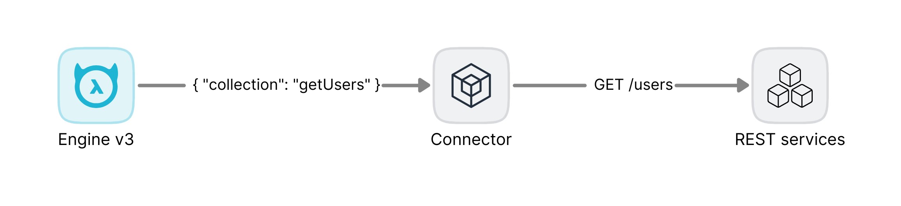

# HTTP Connector

HTTP Connector allows you to quickly convert HTTP APIs to NDC schema and proxy requests from GraphQL Engine v3 to remote services.
The connector can automatically transform OpenAPI 2.0 and 3.0 definitions to NDC schema.



> [!NOTE]
> HTTP connector is configuration-based HTTP engine and isn't limited to the OpenAPI specs only. Use [OpenAPI Connector](https://hasura.io/docs/3.0/connectors/external-apis/open-api) if you want to take more control of OpenAPI via code generation.

## Features

- [No code. Configuration based](#configuration).
- Composable API collections.
- [Supported many API specifications](#supported-specs).
- [Supported authentication](./docs/authentication.md).
- [Supported headers forwarding](./docs/authentication.md#headers-forwarding).
- [Supported argument presets](./docs/argument_presets.md).
- [Supported timeout and retry](#timeout-and-retry).
- Supported concurrency and [sending distributed requests](./docs/distribution.md) to multiple servers.

**Supported request types**

| Request Type | Query | Path | Body | Headers |
| ------------ | ----- | ---- | ---- | ------- |
| GET          | ✅    | ✅   | NA   | ✅      |
| POST         | ✅    | ✅   | ✅   | ✅      |
| DELETE       | ✅    | ✅   | ✅   | ✅      |
| PUT          | ✅    | ✅   | ✅   | ✅      |
| PATCH        | ✅    | ✅   | ✅   | ✅      |

**Supported content types**

| Content Type                      | Supported |
| --------------------------------- | --------- |
| application/json                  | ✅        |
| application/xml                   | ✅        |
| application/x-www-form-urlencoded | ✅        |
| multipart/form-data               | ✅        |
| application/octet-stream          | ✅ (\*)   |
| text/\*                           | ✅        |
| application/x-ndjson              | ✅        |
| image/\*                          | ✅ (\*)   |

\*: Upload file content types are converted to `base64` encoding.

**Supported authentication**

| Security scheme | Supported | Comment                                                                                                                                   |
| --------------- | --------- | ----------------------------------------------------------------------------------------------------------------------------------------- |
| API Key         | ✅        |                                                                                                                                           |
| Basic Auth      | ✅        |                                                                                                                                           |
| Bearer Auth     | ✅        |                                                                                                                                           |
| Cookies         | ✅        | Require forwarding the `Cookie` header from the Hasura engine.                                                                            |
| OAuth 2.0       | ✅        | Built-in support for the `client_credentials` grant. Other grant types require forwarding access tokens from headers by the Hasura engine |
| mTLS            | ✅        |                                                                                                                                           |

## Quick start

Start the connector server at http://localhost:8080 using the [JSON Placeholder](https://jsonplaceholder.typicode.com/) APIs.

```go
go run ./server serve --configuration ./connector/testdata/jsonplaceholder
```

## Documentation

- [NDC HTTP schema](./ndc-http-schema)
- [Authentication](./docs/authentication.md)
- [Argument Presets](./docs/argument_presets.md)
- [Distributed Execution](./docs/distribution.md)
- [Recipes](https://github.com/hasura/ndc-http-recipes/tree/main): You can find or request pre-built configuration recipes of popular API services here.

## Configuration

The connector reads `config.{json,yaml}` file in the configuration folder. The file contains information about the schema file path and its specification:

```yaml
files:
  - file: swagger.json
    spec: openapi2
  - file: openapi.yaml
    spec: openapi3
    trimPrefix: /v1
    envPrefix: PET_STORE
  - file: schema.json
    spec: ndc
```

The config of each element follows the [config schema](https://github.com/hasura/ndc-http/ndc-http-schema/blob/main/config.example.yaml) of `ndc-http-schema`.

You can add many API documentation files into the same connector.

> [!IMPORTANT]
> Conflicted object and scalar types will be ignored. Only the type of the first file is kept in the schema.

### Supported specs

#### OpenAPI

HTTP connector supports both OpenAPI 2 and 3 specifications.

- `oas3`/`openapi3`: OpenAPI 3.0/3.1.
- `oas2`/`openapi2`: OpenAPI 2.0.

#### HTTP Connector schema

Enum: `ndc`

HTTP schema is the native configuration schema which other specs will be converted to behind the scene. The schema extends the NDC Specification with HTTP configuration and can be converted from other specs by the [NDC HTTP schema CLI](./ndc-http-schema).

### Timeout and retry

The global timeout and retry strategy can be configured in each file:

```yaml
files:
  - file: swagger.json
    spec: oas2
    timeout:
      value: 30
    retry:
      times:
        value: 1
      delay:
        # delay between each retry in milliseconds
        value: 500
      httpStatus: [429, 500, 502, 503]
```

### JSON Patch

You can add JSON patches to extend API documentation files. HTTP connector supports `merge` and `json6902` strategies. JSON patches can be applied before or after the conversion from OpenAPI to HTTP schema configuration. It will be useful if you need to extend or fix some fields in the API documentation such as server URL.

```yaml
files:
  - file: openapi.yaml
    spec: oas3
    patchBefore:
      - path: patch-before.yaml
        strategy: merge
    patchAfter:
      - path: patch-after.yaml
        strategy: json6902
```

See [the example](./ndc-http-schema/command/testdata/patch) for more context.

## License

HTTP Connector is available under the [Apache License 2.0](./LICENSE).
